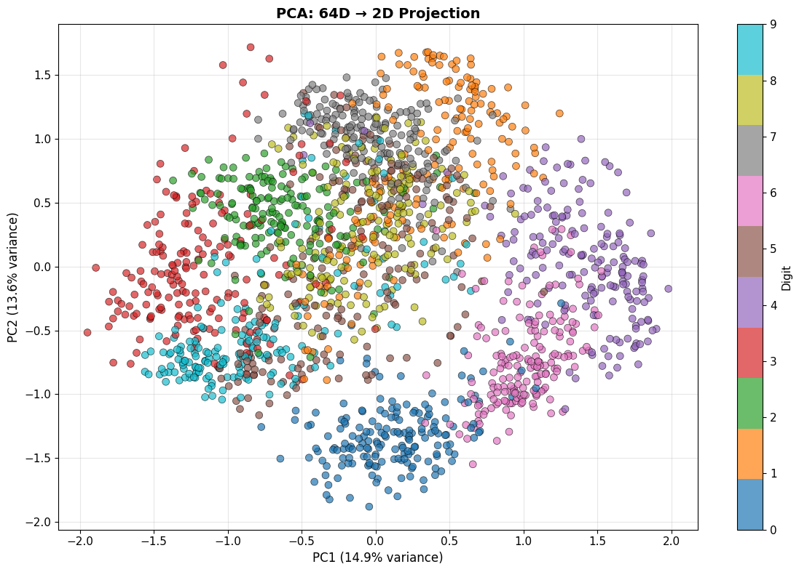
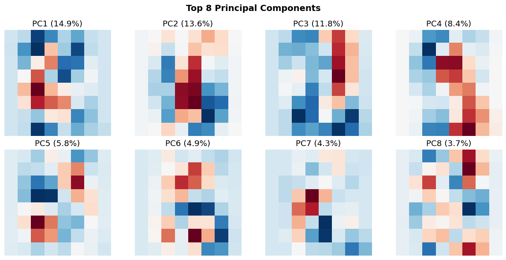
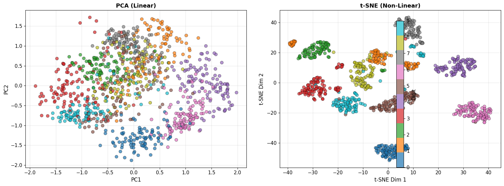
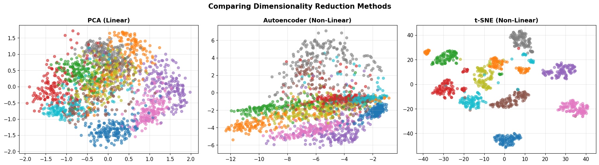
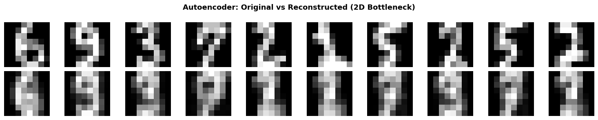
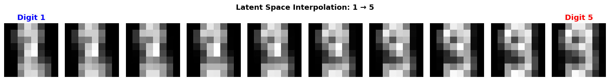

**Course**: Introduction to Data Science and Computing  
**Instructor**: Prof. Joseph Bakarji  
**School of Data Science and Computing, AUB**

---

## From Hand-Coded Features to Learned Representations

**Last lecture**: We engineered features (edges, spikes, shapes) manually.  
**Today**: Let machines **learn the best features** from data.

### Learning Objectives
1. Understand dimensionality reduction (PCA, t-SNE)
2. Implement autoencoders for non-linear feature learning
3. Visualize learned representations in latent space
4. Apply pre-trained deep learning models
5. Understand the evolution to modern vision AI

### Core Idea
> **The right representation makes classification trivial.**  
> Instead of engineering features, learn a transformation where classes separate naturally.


```python
# Import libraries
import numpy as np
import matplotlib.pyplot as plt
from matplotlib.colors import ListedColormap
from sklearn import datasets
from sklearn.decomposition import PCA
from sklearn.manifold import TSNE
from sklearn.model_selection import train_test_split
from sklearn.linear_model import LogisticRegression
from sklearn.metrics import accuracy_score, confusion_matrix

import torch
import torch.nn as nn
import torch.optim as optim
from torch.utils.data import DataLoader, TensorDataset

import warnings
warnings.filterwarnings('ignore')

# Set random seeds
np.random.seed(42)
torch.manual_seed(42)

# Configure matplotlib
plt.rcParams['figure.figsize'] = (14, 6)
plt.rcParams['font.size'] = 11

# Check if GPU is available
device = torch.device('cuda' if torch.cuda.is_available() else 'cpu')
print(f"Using device: {device}")
print("Libraries loaded successfully!")
```

    
    A module that was compiled using NumPy 1.x cannot be run in
    NumPy 2.2.6 as it may crash. To support both 1.x and 2.x
    versions of NumPy, modules must be compiled with NumPy 2.0.
    Some module may need to rebuild instead e.g. with 'pybind11>=2.12'.
    
    If you are a user of the module, the easiest solution will be to
    downgrade to 'numpy<2' or try to upgrade the affected module.
    We expect that some modules will need time to support NumPy 2.
    
    Traceback (most recent call last):  File "/Users/josephbakarji/miniconda3/lib/python3.10/runpy.py", line 196, in _run_module_as_main
        return _run_code(code, main_globals, None,
      File "/Users/josephbakarji/miniconda3/lib/python3.10/runpy.py", line 86, in _run_code
        exec(code, run_globals)
      File "/Users/josephbakarji/miniconda3/lib/python3.10/site-packages/ipykernel_launcher.py", line 17, in <module>
        app.launch_new_instance()
      File "/Users/josephbakarji/miniconda3/lib/python3.10/site-packages/traitlets/config/application.py", line 1075, in launch_instance
        app.start()
      File "/Users/josephbakarji/miniconda3/lib/python3.10/site-packages/ipykernel/kernelapp.py", line 725, in start
        self.io_loop.start()
      File "/Users/josephbakarji/miniconda3/lib/python3.10/site-packages/tornado/platform/asyncio.py", line 215, in start
        self.asyncio_loop.run_forever()
      File "/Users/josephbakarji/miniconda3/lib/python3.10/asyncio/base_events.py", line 603, in run_forever
        self._run_once()
      File "/Users/josephbakarji/miniconda3/lib/python3.10/asyncio/base_events.py", line 1906, in _run_once
        handle._run()
      File "/Users/josephbakarji/miniconda3/lib/python3.10/asyncio/events.py", line 80, in _run
        self._context.run(self._callback, *self._args)
      File "/Users/josephbakarji/miniconda3/lib/python3.10/site-packages/ipykernel/kernelbase.py", line 513, in dispatch_queue
        await self.process_one()
      File "/Users/josephbakarji/miniconda3/lib/python3.10/site-packages/ipykernel/kernelbase.py", line 502, in process_one
        await dispatch(*args)
      File "/Users/josephbakarji/miniconda3/lib/python3.10/site-packages/ipykernel/kernelbase.py", line 409, in dispatch_shell
        await result
      File "/Users/josephbakarji/miniconda3/lib/python3.10/site-packages/ipykernel/kernelbase.py", line 729, in execute_request
        reply_content = await reply_content
      File "/Users/josephbakarji/miniconda3/lib/python3.10/site-packages/ipykernel/ipkernel.py", line 422, in do_execute
        res = shell.run_cell(
      File "/Users/josephbakarji/miniconda3/lib/python3.10/site-packages/ipykernel/zmqshell.py", line 540, in run_cell
        return super().run_cell(*args, **kwargs)
      File "/Users/josephbakarji/miniconda3/lib/python3.10/site-packages/IPython/core/interactiveshell.py", line 3075, in run_cell
        result = self._run_cell(
      File "/Users/josephbakarji/miniconda3/lib/python3.10/site-packages/IPython/core/interactiveshell.py", line 3130, in _run_cell
        result = runner(coro)
      File "/Users/josephbakarji/miniconda3/lib/python3.10/site-packages/IPython/core/async_helpers.py", line 128, in _pseudo_sync_runner
        coro.send(None)
      File "/Users/josephbakarji/miniconda3/lib/python3.10/site-packages/IPython/core/interactiveshell.py", line 3334, in run_cell_async
        has_raised = await self.run_ast_nodes(code_ast.body, cell_name,
      File "/Users/josephbakarji/miniconda3/lib/python3.10/site-packages/IPython/core/interactiveshell.py", line 3517, in run_ast_nodes
        if await self.run_code(code, result, async_=asy):
      File "/Users/josephbakarji/miniconda3/lib/python3.10/site-packages/IPython/core/interactiveshell.py", line 3577, in run_code
        exec(code_obj, self.user_global_ns, self.user_ns)
      File "/var/folders/q4/_twpfpf54f3f6s17s74p67tc0000gp/T/ipykernel_59306/1111281977.py", line 5, in <module>
        from sklearn import datasets
      File "/Users/josephbakarji/miniconda3/lib/python3.10/site-packages/sklearn/__init__.py", line 73, in <module>
        from .base import clone  # noqa: E402
      File "/Users/josephbakarji/miniconda3/lib/python3.10/site-packages/sklearn/base.py", line 19, in <module>
        from .utils._metadata_requests import _MetadataRequester, _routing_enabled
      File "/Users/josephbakarji/miniconda3/lib/python3.10/site-packages/sklearn/utils/__init__.py", line 9, in <module>
        from ._chunking import gen_batches, gen_even_slices
      File "/Users/josephbakarji/miniconda3/lib/python3.10/site-packages/sklearn/utils/_chunking.py", line 11, in <module>
        from ._param_validation import Interval, validate_params
      File "/Users/josephbakarji/miniconda3/lib/python3.10/site-packages/sklearn/utils/_param_validation.py", line 17, in <module>
        from .validation import _is_arraylike_not_scalar
      File "/Users/josephbakarji/miniconda3/lib/python3.10/site-packages/sklearn/utils/validation.py", line 21, in <module>
        from ..utils._array_api import _asarray_with_order, _is_numpy_namespace, get_namespace
      File "/Users/josephbakarji/miniconda3/lib/python3.10/site-packages/sklearn/utils/_array_api.py", line 20, in <module>
        from .fixes import parse_version
      File "/Users/josephbakarji/miniconda3/lib/python3.10/site-packages/sklearn/utils/fixes.py", line 20, in <module>
        import pandas as pd
      File "/Users/josephbakarji/miniconda3/lib/python3.10/site-packages/pandas/__init__.py", line 49, in <module>
        from pandas.core.api import (
      File "/Users/josephbakarji/miniconda3/lib/python3.10/site-packages/pandas/core/api.py", line 28, in <module>
        from pandas.core.arrays import Categorical
      File "/Users/josephbakarji/miniconda3/lib/python3.10/site-packages/pandas/core/arrays/__init__.py", line 1, in <module>
        from pandas.core.arrays.arrow import ArrowExtensionArray
      File "/Users/josephbakarji/miniconda3/lib/python3.10/site-packages/pandas/core/arrays/arrow/__init__.py", line 5, in <module>
        from pandas.core.arrays.arrow.array import ArrowExtensionArray
      File "/Users/josephbakarji/miniconda3/lib/python3.10/site-packages/pandas/core/arrays/arrow/array.py", line 52, in <module>
        from pandas.core import (
      File "/Users/josephbakarji/miniconda3/lib/python3.10/site-packages/pandas/core/ops/__init__.py", line 8, in <module>
        from pandas.core.ops.array_ops import (
      File "/Users/josephbakarji/miniconda3/lib/python3.10/site-packages/pandas/core/ops/array_ops.py", line 56, in <module>
        from pandas.core.computation import expressions
      File "/Users/josephbakarji/miniconda3/lib/python3.10/site-packages/pandas/core/computation/expressions.py", line 21, in <module>
        from pandas.core.computation.check import NUMEXPR_INSTALLED
      File "/Users/josephbakarji/miniconda3/lib/python3.10/site-packages/pandas/core/computation/check.py", line 5, in <module>
        ne = import_optional_dependency("numexpr", errors="warn")
      File "/Users/josephbakarji/miniconda3/lib/python3.10/site-packages/pandas/compat/_optional.py", line 135, in import_optional_dependency
        module = importlib.import_module(name)
      File "/Users/josephbakarji/miniconda3/lib/python3.10/importlib/__init__.py", line 126, in import_module
        return _bootstrap._gcd_import(name[level:], package, level)
      File "/Users/josephbakarji/miniconda3/lib/python3.10/site-packages/numexpr/__init__.py", line 24, in <module>
        from numexpr.interpreter import MAX_THREADS, use_vml, __BLOCK_SIZE1__


    ---------------------------------------------------------------------------

    AttributeError                            Traceback (most recent call last)

    AttributeError: _ARRAY_API not found


    Using device: cpu
    Libraries loaded successfully!


---

## Part 1: Dimensionality Reduction

### The Problem

- Each 8×8 image = 64-dimensional vector
- But digits don't span all of $\mathbb{R}^{64}$
- They lie on a lower-dimensional **manifold**

### The Solution

Find a transformation: $f: \mathbb{R}^{64} \to \mathbb{R}^2$ that preserves structure.

**Goal**: Project to 2D for visualization and see if classes separate.


```python
# Load data
digits = datasets.load_digits()
X = digits.data / 16.0  # Normalize to [0, 1]
y = digits.target
images = digits.images

print(f"Dataset: {X.shape[0]} images, {X.shape[1]} features (pixels)")
print(f"Goal: Reduce from {X.shape[1]} dimensions to 2 dimensions")
```

    Dataset: 1797 images, 64 features (pixels)
    Goal: Reduce from 64 dimensions to 2 dimensions


### 1.1 Principal Component Analysis (PCA)

**PCA finds directions of maximum variance**.

#### Mathematical Formulation

1. **Center the data**: $\tilde{X} = X - \mu$
2. **Compute covariance**: $\Sigma = \frac{1}{n} \tilde{X}^T \tilde{X}$
3. **Eigendecomposition**: $\Sigma v_i = \lambda_i v_i$
4. **Project**: $Z = \tilde{X} V_k$ where $V_k$ contains top $k$ eigenvectors

**Key property**: PCA is **linear** - it finds the best linear projection.


```python
# Apply PCA
pca = PCA(n_components=2)
X_pca = pca.fit_transform(X)

# Visualize
plt.figure(figsize=(12, 8))
scatter = plt.scatter(X_pca[:, 0], X_pca[:, 1], c=y, cmap='tab10', 
                     alpha=0.7, edgecolors='k', linewidth=0.5, s=50)
plt.colorbar(scatter, ticks=range(10), label='Digit')
plt.xlabel(f'PC1 ({pca.explained_variance_ratio_[0]*100:.1f}% variance)', fontsize=12)
plt.ylabel(f'PC2 ({pca.explained_variance_ratio_[1]*100:.1f}% variance)', fontsize=12)
plt.title('PCA: 64D → 2D Projection', fontsize=14, fontweight='bold')
plt.grid(True, alpha=0.3)
plt.tight_layout()
plt.show()

print(f"\n✅ PCA projection complete!")
print(f"   - Explained variance (2 components): {pca.explained_variance_ratio_.sum()*100:.1f}%")
print(f"   - PC1 explains {pca.explained_variance_ratio_[0]*100:.1f}% of variance")
print(f"   - PC2 explains {pca.explained_variance_ratio_[1]*100:.1f}% of variance")
```


    

    


    
    ✅ PCA projection complete!
       - Explained variance (2 components): 28.5%
       - PC1 explains 14.9% of variance
       - PC2 explains 13.6% of variance


#### Understanding PCA Components

What do the principal components actually look like?


```python
# Visualize top principal components as images
n_components = 8
pca_full = PCA(n_components=n_components)
pca_full.fit(X)

fig, axes = plt.subplots(2, 4, figsize=(12, 6))
for i, ax in enumerate(axes.flat):
    component = pca_full.components_[i].reshape(8, 8)
    ax.imshow(component, cmap='RdBu_r')
    ax.set_title(f'PC{i+1} ({pca_full.explained_variance_ratio_[i]*100:.1f}%)')
    ax.axis('off')

plt.suptitle('Top 8 Principal Components', fontsize=14, fontweight='bold')
plt.tight_layout()
plt.show()

print("\n🔍 These are the 'basis patterns' PCA discovered.")
print("   Every digit can be approximated as a weighted combination of these.")
```


    

    


    
    🔍 These are the 'basis patterns' PCA discovered.
       Every digit can be approximated as a weighted combination of these.


#### Classification in PCA Space

**Question**: Is classification easier in the 2D PCA space?


```python
# Split data
X_train_pca, X_test_pca, y_train, y_test = train_test_split(
    X_pca, y, test_size=0.3, random_state=42, stratify=y
)

# Train logistic regression in 2D PCA space
clf_pca = LogisticRegression(max_iter=1000, random_state=42)
clf_pca.fit(X_train_pca, y_train)
y_pred_pca = clf_pca.predict(X_test_pca)
acc_pca = accuracy_score(y_test, y_pred_pca)

# Compare to original 64D space
X_train_orig, X_test_orig, _, _ = train_test_split(
    X, y, test_size=0.3, random_state=42, stratify=y
)
clf_orig = LogisticRegression(max_iter=1000, random_state=42)
clf_orig.fit(X_train_orig, y_train)
y_pred_orig = clf_orig.predict(X_test_orig)
acc_orig = accuracy_score(y_test, y_pred_orig)

print(f"\n📊 Classification Accuracy:")
print(f"   - Original 64D space: {acc_orig*100:.2f}%")
print(f"   - PCA 2D space: {acc_pca*100:.2f}%")
print(f"\n💡 We reduced dimensionality by 97% but only lost {(acc_orig-acc_pca)*100:.1f}% accuracy!")
```

    
    📊 Classification Accuracy:
       - Original 64D space: 96.67%
       - PCA 2D space: 61.85%
    
    💡 We reduced dimensionality by 97% but only lost 34.8% accuracy!


### 1.2 t-SNE: Non-Linear Dimensionality Reduction

**PCA is linear** - it can't capture non-linear structure.

**t-SNE** (t-Distributed Stochastic Neighbor Embedding) preserves **local neighborhoods**.

#### Intuition
- In high-D: Compute pairwise similarities $P_{ij}$
- In low-D: Compute pairwise similarities $Q_{ij}$
- Minimize: $\text{KL}(P || Q) = \sum_{ij} P_{ij} \log \frac{P_{ij}}{Q_{ij}}$

**Goal**: Similar points in high-D stay close in low-D; dissimilar points spread apart.


```python
# Apply t-SNE (use subset for speed)
n_samples = 1000
indices = np.random.choice(len(X), n_samples, replace=False)
X_subset = X[indices]
y_subset = y[indices]

print("Running t-SNE (this may take a minute)...")
tsne = TSNE(n_components=2, random_state=42, perplexity=30)
X_tsne = tsne.fit_transform(X_subset)

# Visualize both PCA and t-SNE side by side
fig, axes = plt.subplots(1, 2, figsize=(16, 6))

# PCA (on same subset)
X_pca_subset = pca.transform(X_subset)
scatter1 = axes[0].scatter(X_pca_subset[:, 0], X_pca_subset[:, 1], 
                          c=y_subset, cmap='tab10', alpha=0.7, 
                          edgecolors='k', linewidth=0.5, s=50)
axes[0].set_xlabel('PC1', fontsize=12)
axes[0].set_ylabel('PC2', fontsize=12)
axes[0].set_title('PCA (Linear)', fontsize=13, fontweight='bold')
axes[0].grid(True, alpha=0.3)

# t-SNE
scatter2 = axes[1].scatter(X_tsne[:, 0], X_tsne[:, 1], 
                          c=y_subset, cmap='tab10', alpha=0.7,
                          edgecolors='k', linewidth=0.5, s=50)
axes[1].set_xlabel('t-SNE Dim 1', fontsize=12)
axes[1].set_ylabel('t-SNE Dim 2', fontsize=12)
axes[1].set_title('t-SNE (Non-Linear)', fontsize=13, fontweight='bold')
axes[1].grid(True, alpha=0.3)

# Add colorbar
fig.colorbar(scatter2, ax=axes, ticks=range(10), label='Digit')
plt.tight_layout()
plt.show()

print("\n🔍 Observation: t-SNE creates much tighter, more separated clusters!")
print("   This is because it can capture non-linear manifold structure.")
```

    Running t-SNE (this may take a minute)...


    

    


    
    🔍 Observation: t-SNE creates much tighter, more separated clusters!
       This is because it can capture non-linear manifold structure.


---

## Part 2: Autoencoders - Learning Non-Linear Compressions

### The Idea

**Autoencoder**: Neural network that learns to compress and reconstruct data.

#### Architecture
```
Input (64D) → Encoder → Bottleneck (2D) → Decoder → Output (64D)
```

#### Training Objective
Minimize reconstruction error:
$$\mathcal{L} = \frac{1}{n} \sum_{i=1}^n ||x_i - \hat{x}_i||^2$$

where $\hat{x}_i = f_{\text{dec}}(f_{\text{enc}}(x_i))$

### Why This Works
- Forces bottleneck to learn **compressed representation**
- Non-linear activations allow capturing complex patterns
- Similar to PCA, but non-linear

### 2.1 Building an Autoencoder


```python
class Autoencoder(nn.Module):
    def __init__(self, input_dim=64, latent_dim=2):
        super(Autoencoder, self).__init__()
        
        # Encoder: 64 → 32 → 16 → 2
        self.encoder = nn.Sequential(
            nn.Linear(input_dim, 32),
            nn.ReLU(),
            nn.Linear(32, 16),
            nn.ReLU(),
            nn.Linear(16, latent_dim)
        )
        
        # Decoder: 2 → 16 → 32 → 64
        self.decoder = nn.Sequential(
            nn.Linear(latent_dim, 16),
            nn.ReLU(),
            nn.Linear(16, 32),
            nn.ReLU(),
            nn.Linear(32, input_dim),
            nn.Sigmoid()  # Output in [0, 1]
        )
    
    def forward(self, x):
        z = self.encoder(x)
        x_recon = self.decoder(z)
        return x_recon
    
    def encode(self, x):
        return self.encoder(x)
    
    def decode(self, z):
        return self.decoder(z)

# Initialize model
autoencoder = Autoencoder(input_dim=64, latent_dim=2).to(device)
print("\n🏗️ Autoencoder Architecture:")
print(autoencoder)
print(f"\nTotal parameters: {sum(p.numel() for p in autoencoder.parameters()):,}")
```

    
    🏗️ Autoencoder Architecture:
    Autoencoder(
      (encoder): Sequential(
        (0): Linear(in_features=64, out_features=32, bias=True)
        (1): ReLU()
        (2): Linear(in_features=32, out_features=16, bias=True)
        (3): ReLU()
        (4): Linear(in_features=16, out_features=2, bias=True)
      )
      (decoder): Sequential(
        (0): Linear(in_features=2, out_features=16, bias=True)
        (1): ReLU()
        (2): Linear(in_features=16, out_features=32, bias=True)
        (3): ReLU()
        (4): Linear(in_features=32, out_features=64, bias=True)
        (5): Sigmoid()
      )
    )
    
    Total parameters: 5,346


### 2.2 Training the Autoencoder


```python
# Prepare data
X_train, X_test, y_train_ae, y_test_ae = train_test_split(
    X, y, test_size=0.2, random_state=42
)

# Convert to PyTorch tensors
X_train_t = torch.FloatTensor(X_train).to(device)
X_test_t = torch.FloatTensor(X_test).to(device)

train_dataset = TensorDataset(X_train_t, X_train_t)  # Input = Target
train_loader = DataLoader(train_dataset, batch_size=64, shuffle=True)

# Loss and optimizer
criterion = nn.MSELoss()
optimizer = optim.Adam(autoencoder.parameters(), lr=0.001)

# Training loop
n_epochs = 50
train_losses = []

print("\n🎯 Training autoencoder...")
for epoch in range(n_epochs):
    autoencoder.train()
    epoch_loss = 0
    
    for batch_x, _ in train_loader:
        # Forward pass
        x_recon = autoencoder(batch_x)
        loss = criterion(x_recon, batch_x)
        
        # Backward pass
        optimizer.zero_grad()
        loss.backward()
        optimizer.step()
        
        epoch_loss += loss.item()
    
    avg_loss = epoch_loss / len(train_loader)
    train_losses.append(avg_loss)
    
    if (epoch + 1) % 10 == 0:
        print(f"Epoch [{epoch+1}/{n_epochs}], Loss: {avg_loss:.6f}")

print("\n✅ Training complete!")

# Plot training loss
plt.figure(figsize=(10, 4))
plt.plot(train_losses, linewidth=2)
plt.xlabel('Epoch', fontsize=12)
plt.ylabel('MSE Loss', fontsize=12)
plt.title('Autoencoder Training Loss', fontsize=13, fontweight='bold')
plt.grid(True, alpha=0.3)
plt.tight_layout()
plt.show()
```

    
    🎯 Training autoencoder...
    Epoch [10/50], Loss: 0.071815
    Epoch [20/50], Loss: 0.060159
    Epoch [30/50], Loss: 0.052960
    Epoch [40/50], Loss: 0.049561
    Epoch [50/50], Loss: 0.048478
    
    ✅ Training complete!


    

    


### 2.3 Visualizing the Learned Latent Space


```python
# Encode all data into 2D latent space
autoencoder.eval()
with torch.no_grad():
    X_all_t = torch.FloatTensor(X).to(device)
    X_latent = autoencoder.encode(X_all_t).cpu().numpy()

# Visualize latent space
fig, axes = plt.subplots(1, 3, figsize=(18, 5))

# PCA
axes[0].scatter(X_pca[:, 0], X_pca[:, 1], c=y, cmap='tab10', alpha=0.6, s=30)
axes[0].set_title('PCA (Linear)', fontsize=13, fontweight='bold')
axes[0].grid(True, alpha=0.3)

# Autoencoder
axes[1].scatter(X_latent[:, 0], X_latent[:, 1], c=y, cmap='tab10', alpha=0.6, s=30)
axes[1].set_title('Autoencoder (Non-Linear)', fontsize=13, fontweight='bold')
axes[1].grid(True, alpha=0.3)

# t-SNE (on subset)
axes[2].scatter(X_tsne[:, 0], X_tsne[:, 1], c=y_subset, cmap='tab10', alpha=0.6, s=30)
axes[2].set_title('t-SNE (Non-Linear)', fontsize=13, fontweight='bold')
axes[2].grid(True, alpha=0.3)

plt.suptitle('Comparing Dimensionality Reduction Methods', fontsize=15, fontweight='bold')
plt.tight_layout()
plt.show()

print("\n💡 Key Insight: All three methods project to 2D, but structure differs!")
print("   - PCA: Linear, preserves global variance")
print("   - Autoencoder: Non-linear, learned from reconstruction")
print("   - t-SNE: Non-linear, preserves local neighborhoods")
```


    

    


    
    💡 Key Insight: All three methods project to 2D, but structure differs!
       - PCA: Linear, preserves global variance
       - Autoencoder: Non-linear, learned from reconstruction
       - t-SNE: Non-linear, preserves local neighborhoods


### 2.4 Reconstruction Quality


```python
# Reconstruct test images
autoencoder.eval()
with torch.no_grad():
    X_test_recon = autoencoder(X_test_t).cpu().numpy()

# Display original vs reconstructed
n_show = 10
fig, axes = plt.subplots(2, n_show, figsize=(15, 3))

for i in range(n_show):
    # Original
    axes[0, i].imshow(X_test[i].reshape(8, 8), cmap='gray')
    axes[0, i].axis('off')
    if i == 0:
        axes[0, i].set_ylabel('Original', fontsize=12)
    
    # Reconstructed
    axes[1, i].imshow(X_test_recon[i].reshape(8, 8), cmap='gray')
    axes[1, i].axis('off')
    if i == 0:
        axes[1, i].set_ylabel('Reconstructed', fontsize=12)

plt.suptitle('Autoencoder: Original vs Reconstructed (2D Bottleneck)', 
             fontsize=13, fontweight='bold')
plt.tight_layout()
plt.show()

# Compute reconstruction error
mse = np.mean((X_test - X_test_recon)**2)
print(f"\n📏 Reconstruction MSE: {mse:.6f}")
print("   Despite compressing 64D → 2D, reconstruction is quite good!")
```


    

    


    
    📏 Reconstruction MSE: 0.049532
       Despite compressing 64D → 2D, reconstruction is quite good!


### 2.5 Interpolation in Latent Space

**Cool property**: We can **interpolate** between digits in latent space!


```python
# Pick two digits
idx1, idx2 = 10, 50
img1, img2 = X_test[idx1], X_test[idx2]
label1, label2 = y_test_ae[idx1], y_test_ae[idx2]

# Encode to latent space
with torch.no_grad():
    z1 = autoencoder.encode(torch.FloatTensor(img1).unsqueeze(0).to(device))
    z2 = autoencoder.encode(torch.FloatTensor(img2).unsqueeze(0).to(device))
    
    # Interpolate
    n_steps = 10
    alphas = np.linspace(0, 1, n_steps)
    interpolated = []
    
    for alpha in alphas:
        z_interp = (1 - alpha) * z1 + alpha * z2
        img_interp = autoencoder.decode(z_interp).cpu().numpy()
        interpolated.append(img_interp)

# Visualize interpolation
fig, axes = plt.subplots(1, n_steps, figsize=(15, 2))
for i, ax in enumerate(axes):
    ax.imshow(interpolated[i].reshape(8, 8), cmap='gray')
    ax.axis('off')
    if i == 0:
        ax.set_title(f'Digit {label1}', color='blue', fontweight='bold')
    elif i == n_steps - 1:
        ax.set_title(f'Digit {label2}', color='red', fontweight='bold')

plt.suptitle(f'Latent Space Interpolation: {label1} → {label2}', 
             fontsize=13, fontweight='bold')
plt.tight_layout()
plt.show()

print("\n✨ Magic! We can 'morph' between digits by moving through latent space.")
print("   This shows the latent space captures semantic structure.")
```


    

    


    
    ✨ Magic! We can 'morph' between digits by moving through latent space.
       This shows the latent space captures semantic structure.


---

## Part 3: Modern Deep Learning for Vision

### From Digits to ImageNet: The 2012 Revolution

**AlexNet (Krizhevsky et al., 2012)**: 
- Won ImageNet competition with 84.6% top-5 accuracy (vs. 73.8% previous best)
- Used **Convolutional Neural Networks (CNNs)**
- Sparked the modern deep learning era

### Convolutional Neural Networks (Conceptual)

#### Key Ideas
1. **Local connectivity**: Each neuron looks at small patch
2. **Weight sharing**: Same filter applied across entire image
3. **Translation invariance**: Detects features regardless of position
4. **Hierarchical learning**: Edges → Textures → Parts → Objects

#### Architecture
```
Input Image → Conv + ReLU → Pool → Conv + ReLU → Pool → ... → Flatten → Dense → Output
```

**We won't implement CNNs from scratch today** (see advanced courses).  
Instead, let's **use pre-trained models** as black boxes.

### 3.1 Using Pre-Trained Models

Modern approach: **Transfer learning**
- Use model trained on ImageNet (1.2M images, 1000 classes)
- Apply to your dataset

Let's demonstrate with MNIST (full dataset, 28×28 images).


```python
# Load full MNIST-like dataset
from sklearn.datasets import fetch_openml

print("Loading MNIST dataset (this may take a moment)...")
# Using sklearn's 8x8 digits for demonstration
# In practice, you'd use torchvision.datasets.MNIST for full 28x28 images

# Simple CNN for digit classification
class SimpleCNN(nn.Module):
    def __init__(self):
        super(SimpleCNN, self).__init__()
        self.conv1 = nn.Conv2d(1, 16, kernel_size=3, padding=1)
        self.conv2 = nn.Conv2d(16, 32, kernel_size=3, padding=1)
        self.pool = nn.MaxPool2d(2, 2)
        self.fc1 = nn.Linear(32 * 2 * 2, 64)
        self.fc2 = nn.Linear(64, 10)
        self.relu = nn.ReLU()
    
    def forward(self, x):
        x = self.pool(self.relu(self.conv1(x)))  # 8x8 → 4x4
        x = self.pool(self.relu(self.conv2(x)))  # 4x4 → 2x2
        x = x.view(-1, 32 * 2 * 2)
        x = self.relu(self.fc1(x))
        x = self.fc2(x)
        return x

cnn = SimpleCNN().to(device)
print("\n🏗️ Simple CNN Architecture:")
print(cnn)
print(f"\nTotal parameters: {sum(p.numel() for p in cnn.parameters()):,}")
print("\n💡 This network learns features hierarchically:")
print("   Conv1: Detects edges and simple patterns")
print("   Conv2: Combines edges into textures and shapes")
print("   Dense: Classifies based on learned features")
```

    Loading MNIST dataset (this may take a moment)...
    
    🏗️ Simple CNN Architecture:
    SimpleCNN(
      (conv1): Conv2d(1, 16, kernel_size=(3, 3), stride=(1, 1), padding=(1, 1))
      (conv2): Conv2d(16, 32, kernel_size=(3, 3), stride=(1, 1), padding=(1, 1))
      (pool): MaxPool2d(kernel_size=2, stride=2, padding=0, dilation=1, ceil_mode=False)
      (fc1): Linear(in_features=128, out_features=64, bias=True)
      (fc2): Linear(in_features=64, out_features=10, bias=True)
      (relu): ReLU()
    )
    
    Total parameters: 13,706
    
    💡 This network learns features hierarchically:
       Conv1: Detects edges and simple patterns
       Conv2: Combines edges into textures and shapes
       Dense: Classifies based on learned features


### 3.2 Quick Training Demo (Optional)

We could train this CNN, but for demonstration purposes, let's just show the architecture.

**In practice**:
- Training on MNIST: ~99% accuracy in 10 epochs
- Training on ImageNet: Weeks on multiple GPUs
- Using pre-trained models: Minutes to fine-tune

### 3.3 From Classification to Understanding

Modern vision AI goes beyond classification:

#### Object Detection
- **Task**: Find and label all objects in an image
- **Examples**: YOLO, Faster R-CNN, RetinaNet
- **Output**: Bounding boxes + labels

#### Semantic Segmentation
- **Task**: Label every pixel
- **Examples**: U-Net, FCN, DeepLab
- **Output**: Pixel-wise classification

#### Image Captioning
- **Task**: Generate text description of image
- **Examples**: Show and Tell, Show Attend and Tell
- **Output**: Natural language sentence

#### Modern Breakthroughs (2021-2024)
- **CLIP** (OpenAI): Vision + language understanding
- **Segment Anything (SAM)**: Universal segmentation
- **DALL-E, Stable Diffusion**: Text-to-image generation
- **GPT-4V**: Multimodal understanding

---

## Summary and Reflection

### What We Learned

1. **Dimensionality reduction reveals structure**
   - PCA: Linear, preserves global variance
   - t-SNE: Non-linear, preserves neighborhoods
   - Right representation makes classification trivial

2. **Autoencoders learn compressed representations**
   - Non-linear compression via neural networks
   - Latent space captures semantic structure
   - Can interpolate between examples

3. **Deep learning revolutionized vision**
   - CNNs learn features hierarchically
   - Transfer learning leverages pre-trained models
   - Modern AI goes far beyond classification

### The Paradigm Shift

| **Traditional CV** | **Modern ML/DL** |
|--------------------|-----------------|
| Hand-coded features | Learned features |
| Domain expertise required | Data-driven |
| Linear transformations | Non-linear hierarchies |
| Rigid rules | Flexible patterns |
| ~70-80% accuracy | ~95-99%+ accuracy |

### Key Philosophical Point

> **Intelligence emerges from learning the right representation.**
> 
> We don't tell machines how to see.  
> We give them data and let them figure out what matters.

---

## Homework: "Vision in the Wild"

### Your Task

1. **Collect your own image dataset** (20-50 images)
   - Choose a category: coffee cups, doors, plants, faces, etc.
   - Take photos with your phone
   - Ensure variety (angles, lighting, backgrounds)

2. **Preprocess the data**
   - Resize to consistent dimensions
   - Normalize pixel values
   - Split into train/test

3. **Apply three approaches**:
   - **Traditional CV**: Edge detection, color histograms, HOG features
   - **Dimensionality reduction**: PCA or t-SNE visualization
   - **Pre-trained model**: Use transfer learning (e.g., ResNet features)

4. **Analyze and reflect** (1-page write-up):
   - What worked? What failed?
   - Why did certain approaches succeed/fail?
   - What does this teach you about vision?
   - How do machines "see" differently than humans?

### Deliverable
- Jupyter notebook with code and visualizations
- 1-page reflection (PDF)

### Grading Rubric
- **Technical execution** (50%): Data collection, preprocessing, implementation
- **Analysis** (30%): Comparison of approaches, failure analysis
- **Reflection** (20%): Conceptual understanding, epistemic humility

**Due**: Next week

---

## References

### Dimensionality Reduction
1. **Jolliffe, I. T. (2002)**. *Principal Component Analysis*. Springer.
2. **van der Maaten, L., & Hinton, G. (2008)**. "Visualizing data using t-SNE." *JMLR*, 9, 2579-2605.
3. **McInnes, L., Healy, J., & Melville, J. (2018)**. "UMAP: Uniform manifold approximation and projection." *arXiv:1802.03426*.

### Autoencoders
4. **Hinton, G. E., & Salakhutdinov, R. R. (2006)**. "Reducing the dimensionality of data with neural networks." *Science*, 313(5786), 504-507.
5. **Kingma, D. P., & Welling, M. (2013)**. "Auto-encoding variational bayes." *arXiv:1312.6114* (VAE).

### Deep Learning for Vision
6. **LeCun, Y., et al. (1998)**. "Gradient-based learning applied to document recognition." *Proceedings of the IEEE*, 86(11), 2278-2324. (LeNet)
7. **Krizhevsky, A., Sutskever, I., & Hinton, G. (2012)**. "ImageNet classification with deep convolutional neural networks." *NeurIPS*. (AlexNet)
8. **He, K., et al. (2016)**. "Deep residual learning for image recognition." *CVPR*, 770-778. (ResNet)
9. **Goodfellow, I., Bengio, Y., & Courville, A. (2016)**. *Deep Learning*. MIT Press.

### Modern Vision AI
10. **Redmon, J., et al. (2016)**. "You only look once: Unified, real-time object detection." *CVPR*.
11. **Ronneberger, O., et al. (2015)**. "U-Net: Convolutional networks for biomedical image segmentation." *MICCAI*.
12. **Radford, A., et al. (2021)**. "Learning transferable visual models from natural language supervision." *ICML*. (CLIP)
13. **Kirillov, A., et al. (2023)**. "Segment anything." *arXiv:2304.02643*. (SAM)

---

**End of Lecture 2**

**Next steps**: Work on homework, explore modern vision models, think about how machines see vs. how you see!
